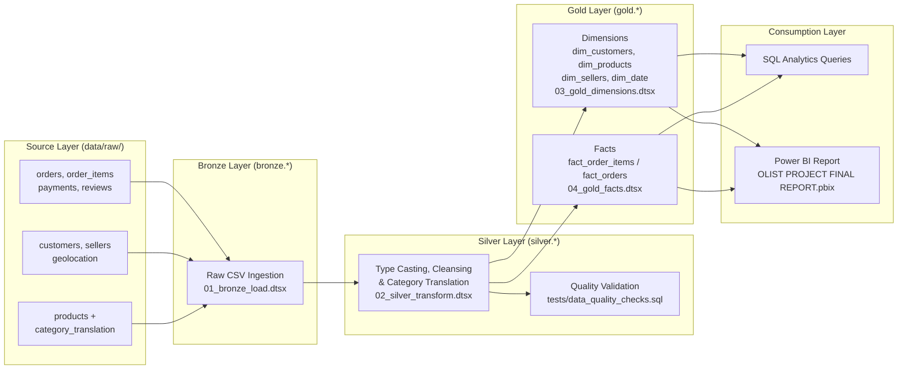

```mermaid
flowchart LR
    subgraph SRC["Source Layer (data/raw/)"]
        CSV1["orders, order_items\npayments, reviews"]
        CSV2["customers, sellers\ngeolocation"]
        CSV3["products +\ncategory_translation"]
    end

    subgraph BRZ["Bronze Layer (bronze.*)"]
        B1["Raw CSV Ingestion\n01_bronze_load.dtsx"]
    end

    subgraph SLV["Silver Layer (silver.*)"]
        S1["Type Casting, Cleansing\n& Category Translation\n02_silver_transform.dtsx"]
        Q1["Quality Validation\ntests/data_quality_checks.sql"]
    end

    subgraph GLD["Gold Layer (gold.*)"]
        G1["Dimensions\ndim_customers, dim_products\ndim_sellers, dim_date\n03_gold_dimensions.dtsx"]
        G2["Facts\nfact_order_items / fact_orders\n04_gold_facts.dtsx"]
    end

    subgraph BI["Consumption Layer"]
        P1["SQL Analytics Queries"]
        P2["Power BI Report\nOLIST PROJECT FINAL REPORT.pbix"]
    end

    CSV1 --> B1
    CSV2 --> B1
    CSV3 --> B1
    B1 --> S1
    S1 --> Q1
    S1 --> G1
    S1 --> G2
    G1 --> P1
    G2 --> P1
    G1 --> P2
    G2 --> P2
```
