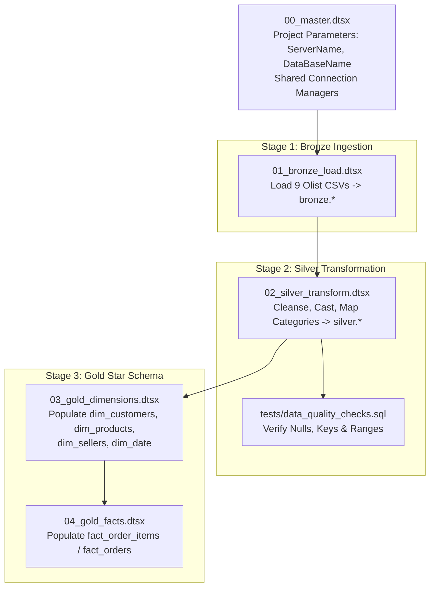

```mermaid
flowchart TD
    M["00_master.dtsx\nProject Parameters: ServerName, DataBaseName\nShared Connection Managers"]

    subgraph B_STAGE["Stage 1: Bronze Ingestion"]
        B1["01_bronze_load.dtsx\nLoad 9 Olist CSVs -> bronze.*"]
    end

    subgraph S_STAGE["Stage 2: Silver Transformation"]
        S1["02_silver_transform.dtsx\nCleanse, Cast, Map Categories -> silver.*"]
        T1["tests/data_quality_checks.sql\nVerify Nulls, Keys & Ranges"]
    end

    subgraph G_STAGE["Stage 3: Gold Star Schema"]
        G1["03_gold_dimensions.dtsx\nPopulate dim_customers, dim_products,\ndim_sellers, dim_date"]
        G2["04_gold_facts.dtsx\nPopulate fact_order_items / fact_orders"]
    end

    M --> B1
    B1 --> S1
    S1 --> T1
    S1 --> G1
    G1 --> G2
```
