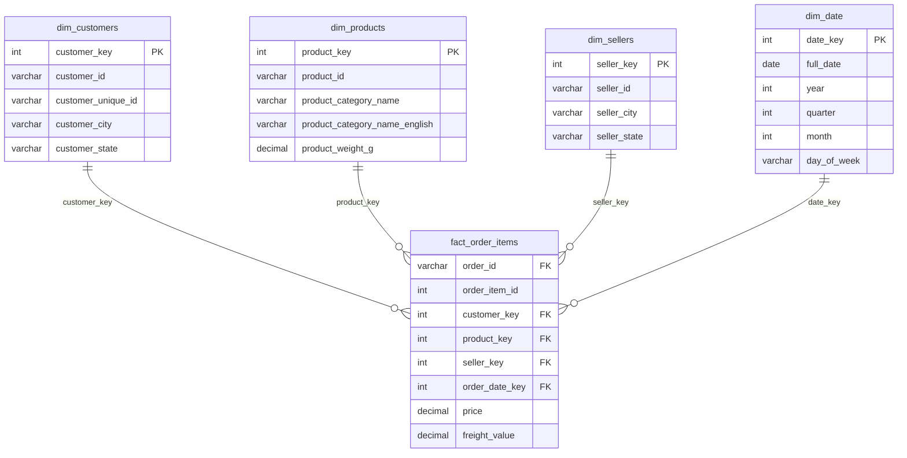

```mermaid
erDiagram
    dim_customers {
        int customer_key PK
        varchar customer_id
        varchar customer_unique_id
        varchar customer_city
        varchar customer_state
    }
    dim_products {
        int product_key PK
        varchar product_id
        varchar product_category_name
        varchar product_category_name_english
        decimal product_weight_g
    }
    dim_sellers {
        int seller_key PK
        varchar seller_id
        varchar seller_city
        varchar seller_state
    }
    dim_date {
        int date_key PK
        date full_date
        int year
        int quarter
        int month
        varchar day_of_week
    }
    fact_order_items {
        varchar order_id FK
        int order_item_id
        int customer_key FK
        int product_key FK
        int seller_key FK
        int order_date_key FK
        decimal price
        decimal freight_value
    }

    dim_customers ||--o{ fact_order_items : "customer_key"
    dim_products ||--o{ fact_order_items : "product_key"
    dim_sellers ||--o{ fact_order_items : "seller_key"
    dim_date ||--o{ fact_order_items : "date_key"
```
